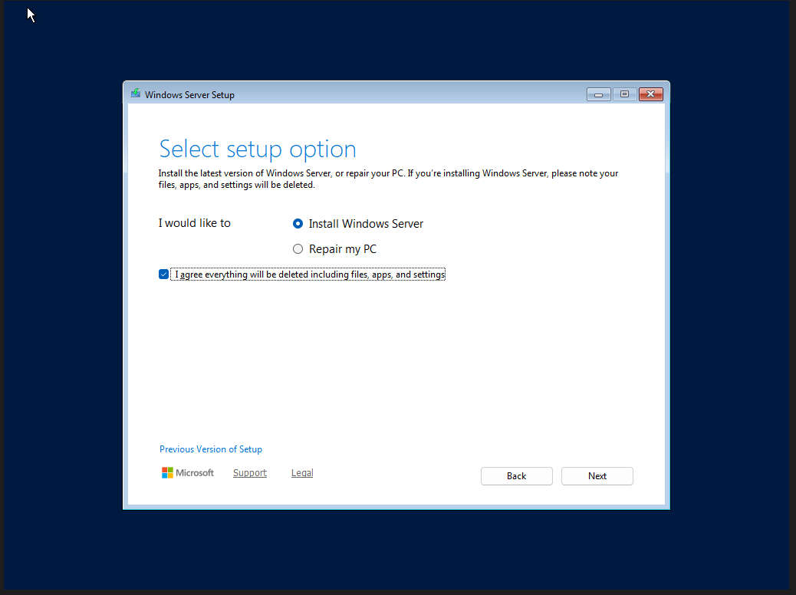
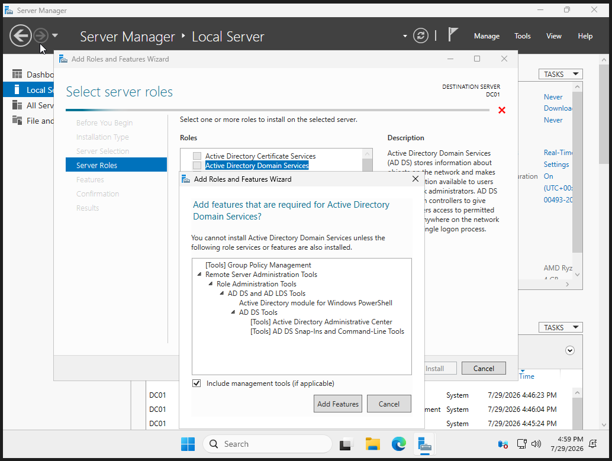
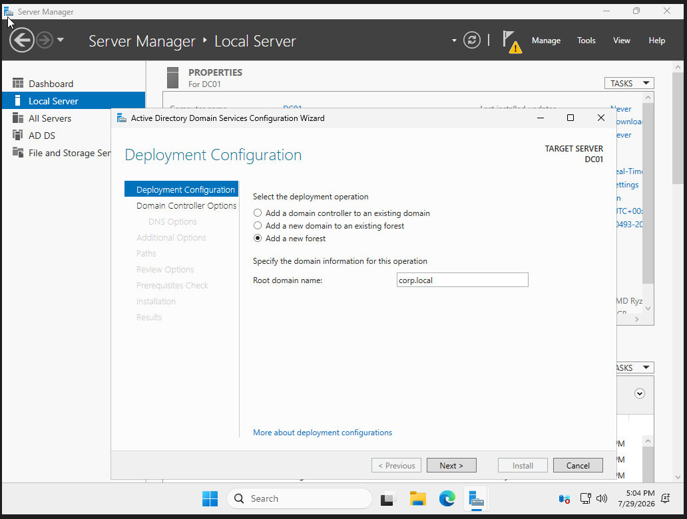
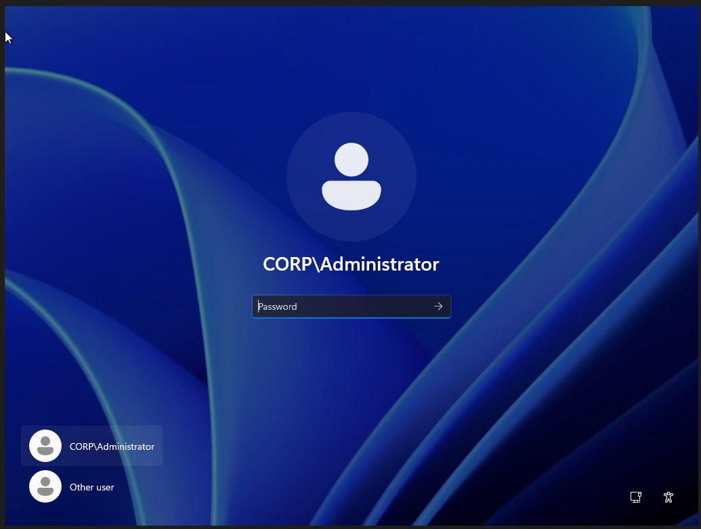
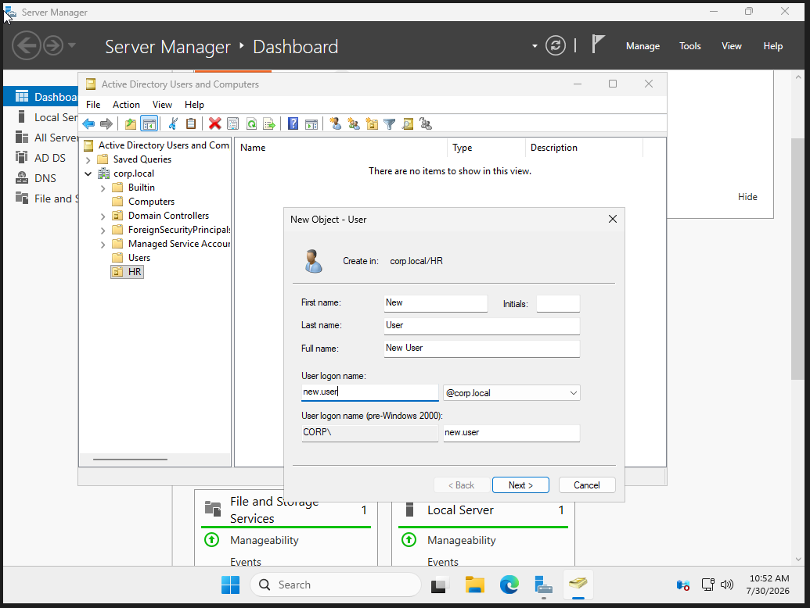
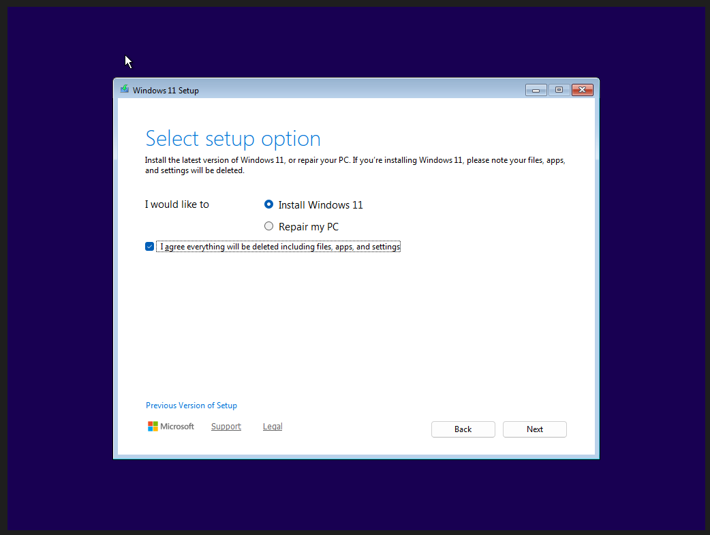
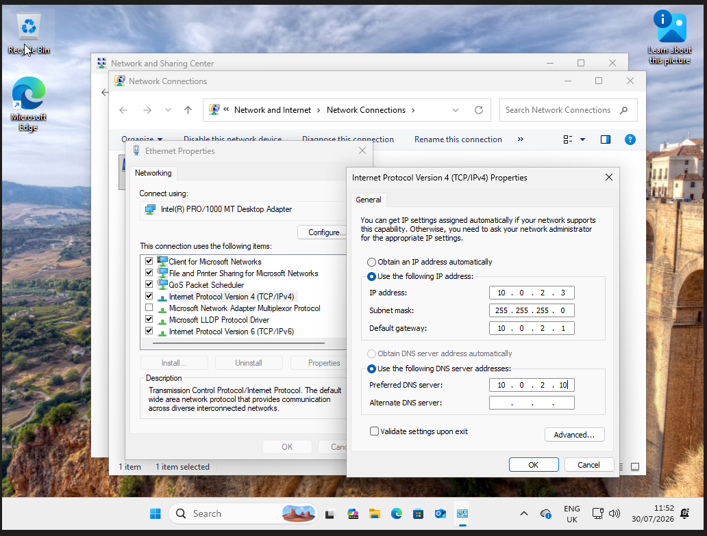
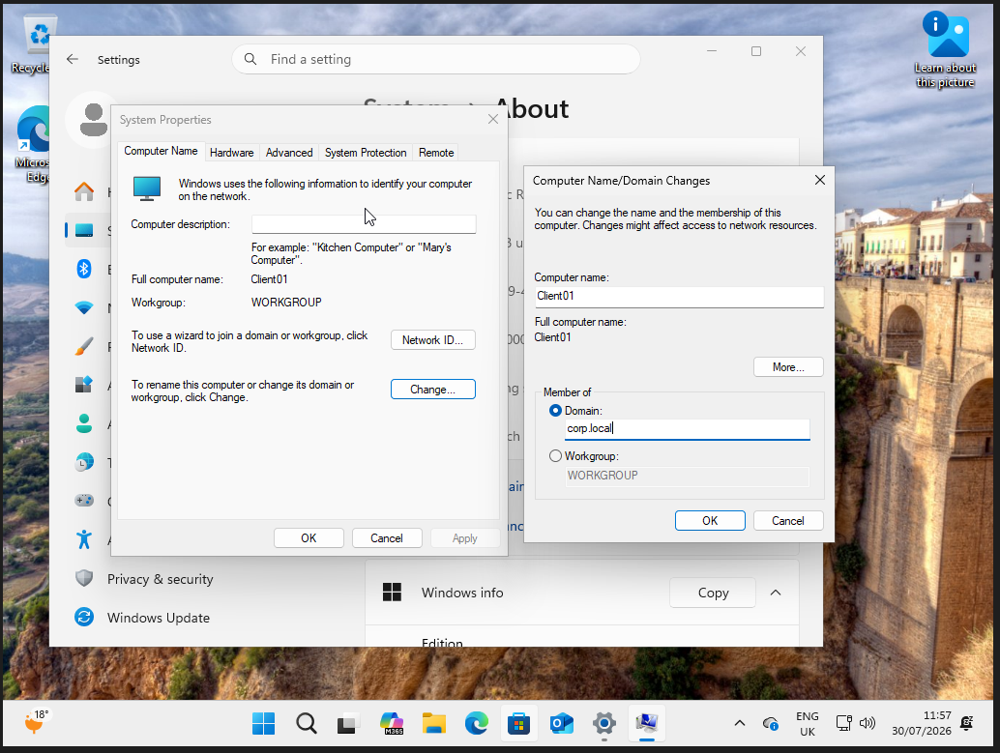
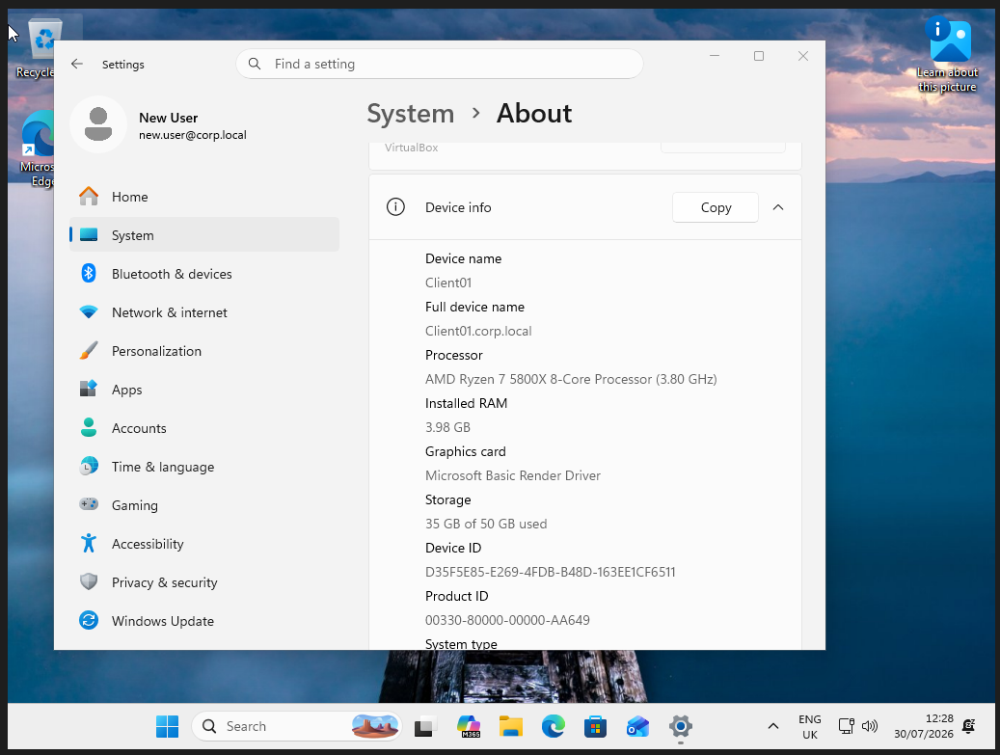
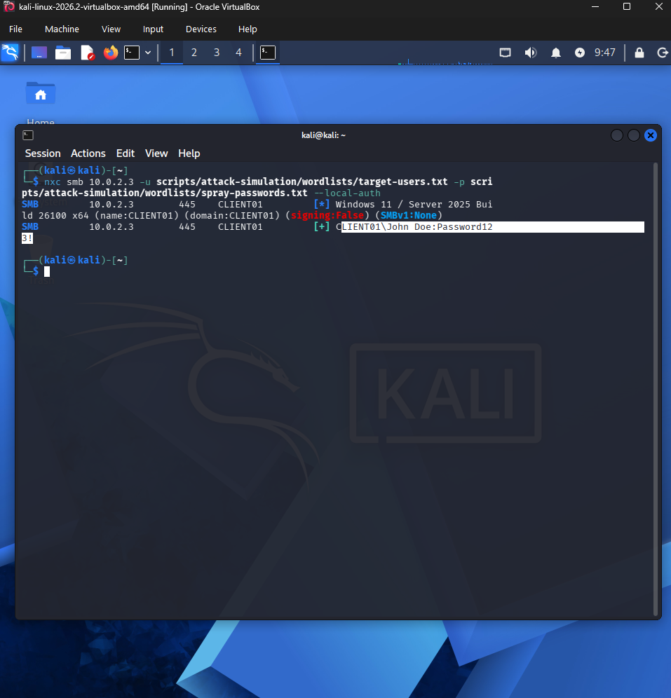

# Enterprise Windows Lab: Network Setup, AD Configuration & Credential Spraying

A comprehensive home lab project demonstrating end-to-end infrastructure setup, Active Directory domain configuration, and security assessment techniques. This project highlights **virtual networking**, **DNS/AD architecture**, and **credential attack simulation** using modern tools.

## Project Scope
1.  **Infrastructure:** Build an isolated virtual network with multiple VMs.
2.  **Networking:** Configure static IPs, DNS, and VirtualBox NAT networking.
3.  **Wintel:** Deploy and configure Windows Server 2022 as a Domain Controller and Windows 11 as a domain-joined client.
4.  **Security:** Execute a password spray attack to test local account security posture.

---

## Phase 1: Virtual Network Architecture

The lab is built on an isolated **VirtualBox Internal Network** to simulate a corporate LAN without exposing the environment to the internet.

### Network Configuration
| VM Role | OS | IP Address | Subnet | DNS |
| :--- | :--- | :--- | :--- | :--- |
| **Domain Controller** | Windows Server 2022 | `10.0.2.10` | `255.255.255.0` | `10.0.2.10` |
| **Client Workstation** | Windows 11 Pro | `10.0.2.3` | `255.255.255.0` | `10.0.2.10` |
| **Attacker** | Kali Linux | `10.0.2.5` | `255.255.255.0` | `10.0.2.10` |

**Key Networking Skills Demonstrated:**
*   **Static IP Assignment:** Configured manually to ensure reliable connectivity.
*   **DNS Forwarding:** Client DNS points to the Domain Controller to enable AD resolution.
*   **Network Isolation:** Used VirtualBox "Internal Network" mode to create a secure, private segment.

---

## Phase 2: Domain Controller Setup (Windows Server)

Configured the core identity infrastructure for the enterprise environment.

### 1. Server Initialization
*   Installed **Windows Server 2022**.
*   Configured **Static IP** (`10.0.2.10`) and set DNS to `10.0.2.10` (localhost).




### 2. Active Directory Domain Services (AD DS)
*   **Promoted to Domain Controller:** Created the `corp.local` forest.
*   **DNS Configuration:** Verified creation of `_msdcs`, `_tcp`, and `_ldap` SRV records essential for AD discovery.
*   **Active Directory User:** Lastly I created an Organisational Unit within Active Directory, along with a new user. This is to showcase how active director can be used to create a hierarchy within the domain and how users can be created and assigned with the domain.





**Key Skills:**
*   Server Manager & AD DS Role installation.
*   DNS Zone management and SRV record verification.
*   Forest and Domain creation.
*   User and Active Directory configuraton.
---

## Phase 3: Client Configuration (Windows 11)

Prepared the client workstation to join the enterprise domain.

### 1. Installation, Network & DNS Configuration
*   Installed Windows 11 Pro.
*   Created a single partition for the drive .
*   Set **Static IP** (`10.0.2.3`).
*   **Critical Step:** Set **Primary DNS** to the Domain Controller IP (`10.0.2.10`).
    *   *Why:* This allows the client to locate the DC via SRV records for domain joining.




### 2. Domain Join
*   Changed computer membership from **Workgroup** to **Domain** (`corp.local`).
*   Provided Domain Admin credentials to authenticate and join.
*   Rebooted and verified successful login with a domain account.




**Key Skills:**
*   Client-side DNS configuration for AD.
*   Domain join process and trust relationship establishment.
*   Troubleshooting DNS resolution for AD services.

---

## Phase 4: Security Assessment (Credential Spraying)

Simulated a real-world attack to test the security posture of local accounts within the domain environment.

### 1. Target Preparation
Created a local administrator account on the Windows 11 client to test against.
```powershell
# PowerShell on Windows 11
New-LocalUser -Name "John Doe" -Password (ConvertTo-SecureString "Password123!" -AsPlainText -Force)
Add-LocalGroupMember -Group "Administrators" -Member "John Doe"
```

### 2. Attack Tooling
Used NetExec (nxc) on Kali Linux to perform a password spray against the SMB service on Client 01 (Port 445)
```bash
nxc smb 10.0.2.3 \
  -u scripts/attack-simulation/wordlists/target-users.txt \
  -p scripts/attack-simulation/wordlists/spray-passwords.txt \
  --local-auth
  ```
  `--local-auth`: Targets the local SAM database to bypass domain authorisaton
  
  `target-users.txt`: A text file containing common usernames, in this example John Doe 
  
  `spray-passwords.txt`: A text file containing a list of common passwords

  ### 3. Results
  Successfully authenticated with the local account, demonstrating that weak local passwords are a critical vulnerability even in a hardened domain environment.
  
  

  ---

  ## Conclusion
  
  ### Why attack a local account instead of the domain?
  Because it's a more realistic finding, not a less impressive one. Security teams spend a lot of effort hardening domain password policy, lockout thresholds, and MFA — and then a local administrator account, created once during imaging or a support call and never touched again, sits on every machine in the fleet with the same weak, shared password. A single Windows domain policy has zero authority over that account. This is one of the most common findings in real internal penetration tests, and it's the reason Microsoft built a dedicated tool (LAPS) to solve it, rather than expecting domain policy to reach far enough.

  ### Why spraying, specifically, and not just guessing one password once?
  A real spray tries a small number of common or seasonal passwords across a large number of accounts, deliberately slowly, to stay under any account-lockout threshold that might be watching. That's the behavior NetExec's `-u`/`-p` list combination simulates here, even against a single local account. The technique, not just the outcome, is what's being demonstrated. This maps to MITRE ATT&CK T1110.003 — Brute Force: Password Spraying under the Credential Access tactic.

  ### What this proves, for a Wintel or Security audience respectively:
  for Wintel, it's evidence of understanding AD structure, DNS-dependent domain join, and the practical boundary of what domain policy actually governs. For security, it's evidence of understanding real attacker tradecraft well enough to simulate it.
  
  ### The Aftermath
  After a successful password spray, a SOC analyst using a SIEM tool such as Splunk or Wazuh would be able to detect two Windows Security Events. A flurry of `EventCode 4625` failed log on attempts and a single `EventCode 4624` successful log on. In isolation, this wouldn't cause alarm as users may forget a password or create typos. The key is the pattern, a number of failures across multiple accounts from a single source. This leads on to incident management process, containment and recovery.
